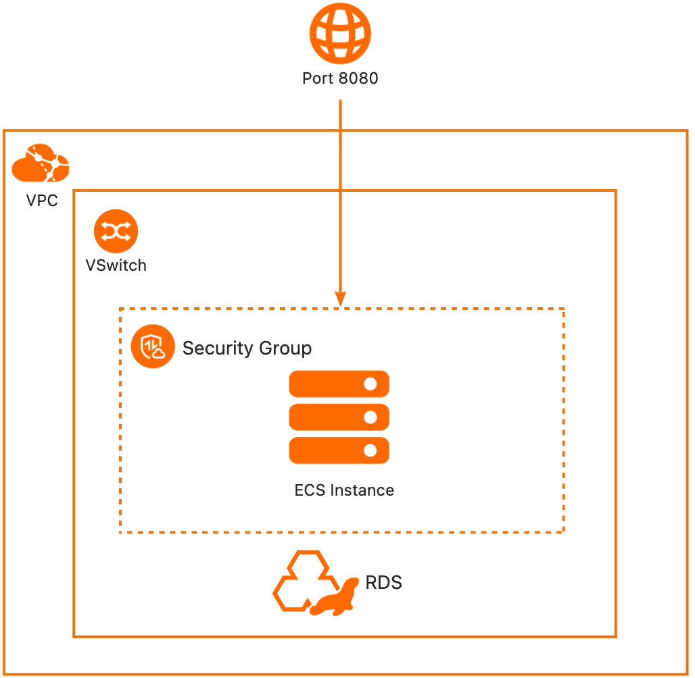
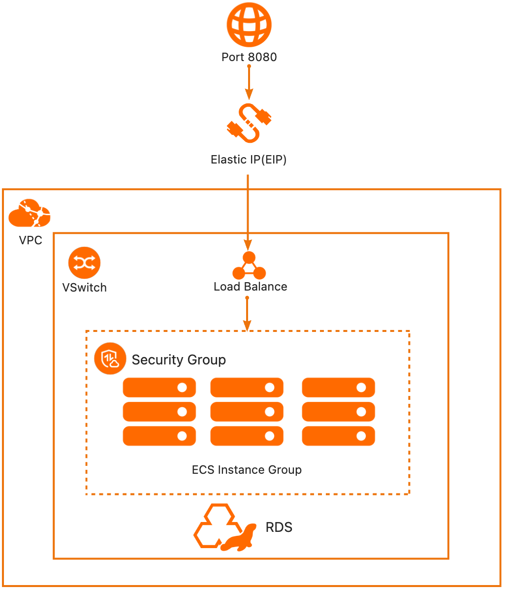
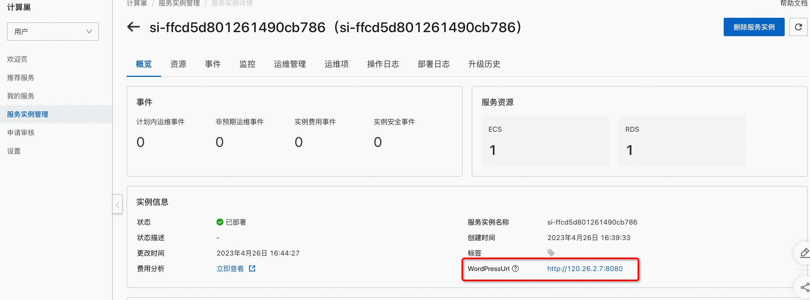

# 服务模板说明文档

## 服务说明

WordPress是一款免费开源的网站内容管理系统（CMS），它可以帮助用户简单快捷地创建和管理自己的网站，包括博客、新闻网站、电子商务网站、社交网络等等。WordPress
有丰富的主题和插件库，使得用户可以轻松地为网站定制外观和功能。WordPress的易用性和可扩展性使其成为世界上最受欢迎的网站建设工具之一。

wordpress服务快速上手流程，本示例对应的Git仓库地址：[wordpress-ecs-demo](https://github.com/aliyun-computenest/wordpress-ecs-demo)。

本示例会自动的构建计算巢服务，具体的服务构建流程为：
1. 上传文件并构建计算巢文件部署物
2. 创建计算巢服务并关联文件部署物

创建过程大约持续5分钟，当服务变成**待提交**后构建成功。

## 服务架构

本部署架构单机版为单机ecs + rds部署，通过公网ip 8080端口访问。

高可用版为多台ecs + slb + rds部署， 通过eip 8080端口访问。

## 服务构建计费说明

测试本服务构建无需任何费用，创建服务实例涉及的费用参考服务实例计费说明。

## 服务实例部署流程

### 部署步骤

0. 部署链接

1. 查看服务实例。服务实例创建成功后，部署时间大约需要6分钟。部署完成后，页面上可以看到对应的服务实例。

2. 通过服务实例访问WordPress,进入到对应的服务实例后，可以在页面上WordPress的登录网址。

