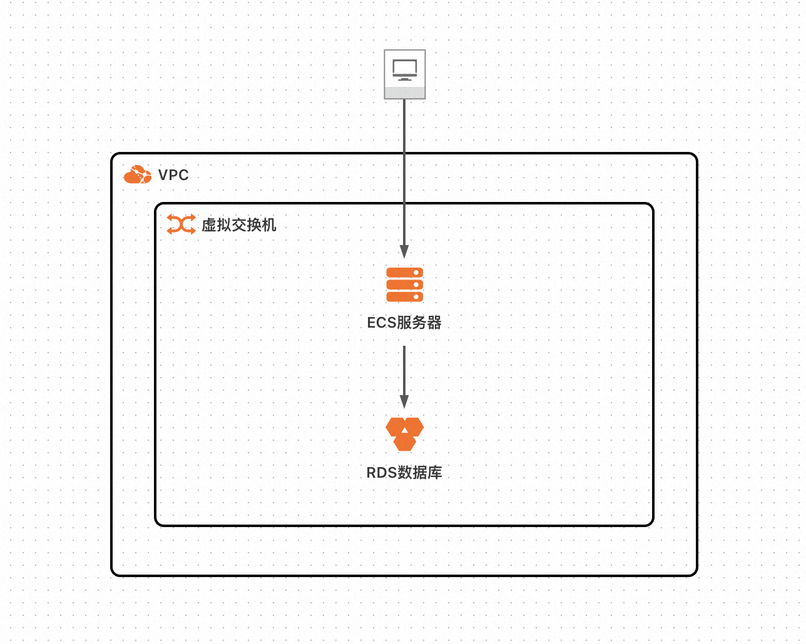
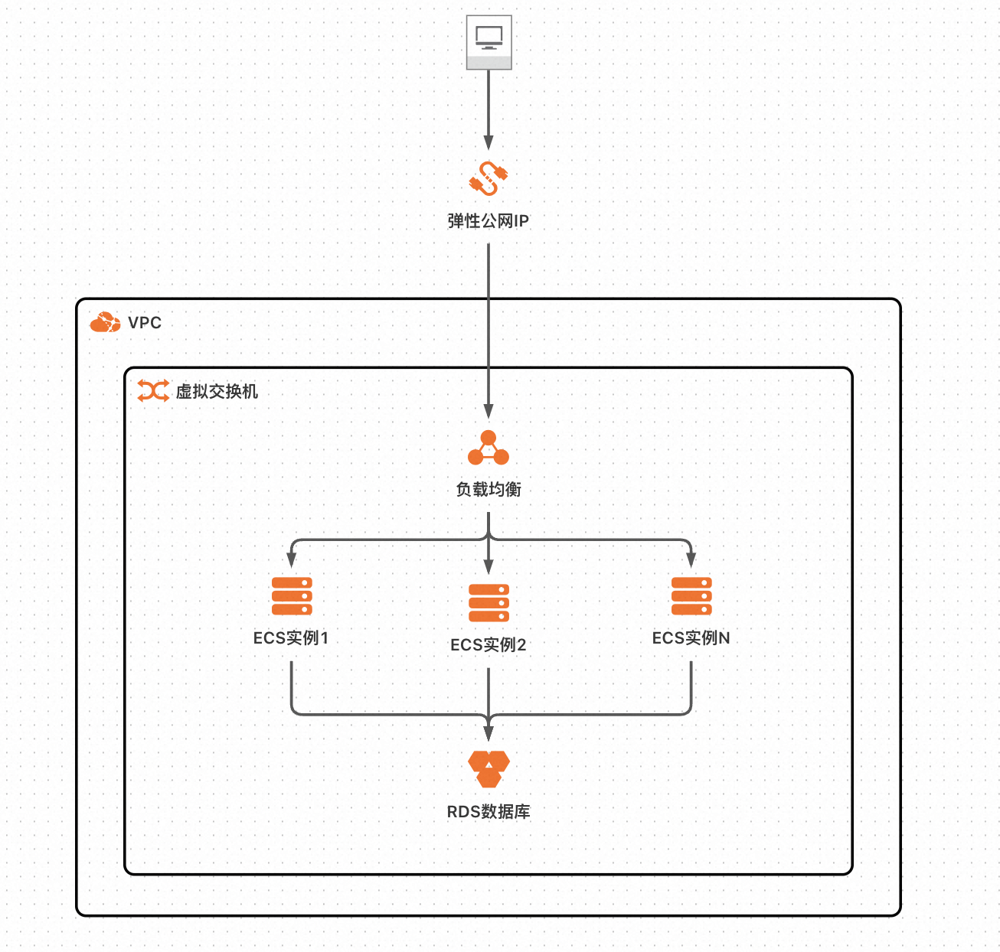
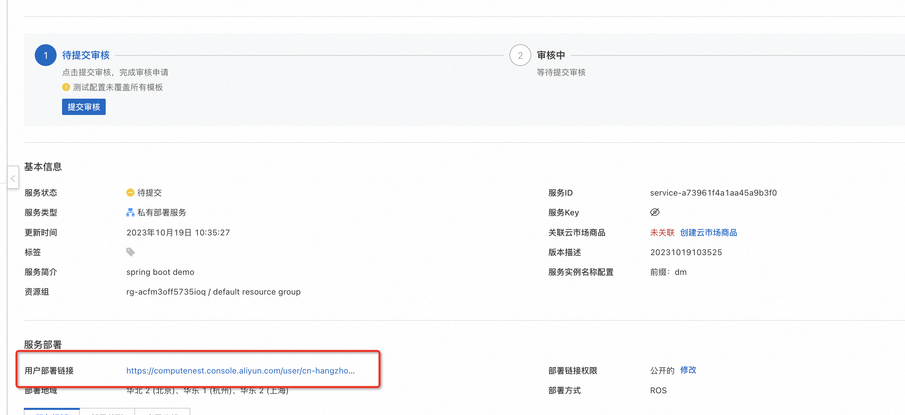
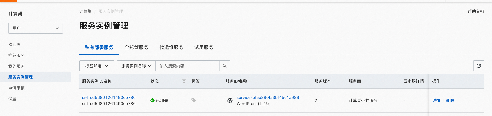
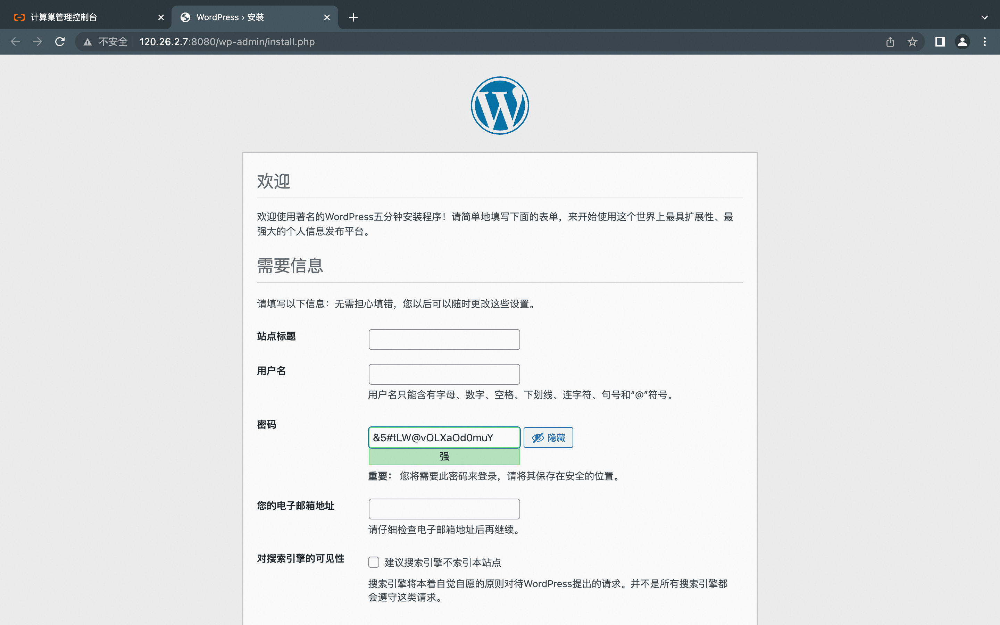

# 服务模版说明文档

## 服务说明

WordPress是一款免费开源的网站内容管理系统（CMS），它可以帮助用户简单快捷地创建和管理自己的网站，包括博客、新闻网站、电子商务网站、社交网络等等。WordPress
有丰富的主题和插件库，使得用户可以轻松地为网站定制外观和功能。WordPress的易用性和可扩展性使其成为世界上最受欢迎的网站建设工具之一。

wordpress服务快速上手流程，本示例对应的[git地址](https://github.com/aliyun-computenest/wordpress-ecs-demo)

本示例会自动的构建计算巢服务，具体的服务构建流程为
1. 上传文件并构建计算巢文件部署物
2. 创建计算巢服务并关联文件部署物

创建过程大约持续5分钟，当服务变成待提交后构建成功

## 服务架构

本部署架构单机版为单机ecs + rds 部署，通过公网ip 8080端口访问


高可用版为多台ecs + slb + rds部署， 通过eip 8080端口访问

## 服务构建计费说明

测试本服务构建无需任何费用，创建服务实例涉及的费用参考服务实例计费说明

## RAM账号所需权限

本服务需要对ECS、VPC等资源进行访问和创建操作，若您使用RAM用户创建服务实例，需要在创建服务实例前，对使用的RAM用户的账号添加相应资源的权限。添加RAM权限的详细操作，请参见[为RAM用户授权](https://help.aliyun.com/document_detail/121945.html)。所需权限如下表所示。

| 权限策略名称                          | 备注                     |
|---------------------------------|------------------------|
| AliyunECSFullAccess             | 管理云服务器服务（ECS）的权限       |
| AliyunVPCFullAccess             | 管理专有网络（VPC）的权限         |
| AliyunROSFullAccess             | 管理资源编排服务（ROS）的权限       |
| AliyunRDSFullAccess | 管理云数据库服务(RDS)的权限 |
| AliyunSLBFullAccess | 管理负载均衡服务(SLB)的权限 |
| AliyunCloudMonitorFullAccess | 管理云监控（CloudMonitor）的权限 |
| AliyunComputeNestUserFullAccess | 管理计算巢服务（ComputeNest）的用户侧权限 |
| AliyunComputeNestSupplierFullAccess | 管理计算巢服务（ComputeNest）的服务商侧权限 |

## 服务实例计费说明

WordPress在计算巢上的费用主要涉及：

- 所选vCPU与内存规格
- 系统盘类型及容量
- 公网带宽
- 数据库配置

计费方式包括：

- 按量付费（小时）
- 包年包月

预估费用在创建实例时可实时看到。


## 服务实例部署流程


### 部署参数说明

| 参数组    | 参数项    | 示例                   | 说明                                                                                   |
|--------|--------|----------------------|--------------------------------------------------------------------------------------|
| 选择模板   | 模板选择   | 多节点版                 | 模板架构类型                                                                               |
| 服务实例名称 |        | test                 | 实例的名称                                                                                |
| 资源组和地域 | 资源组    | 默认资源组                | 创建的服务实例位于的资源组                                    <br/><br/><br/><br/><br/><br/><br/>   <br/> |
| 资源组和地域 | 地域     | 华东1（杭州）              | 选中服务实例的地域，建议就近选中，以获取更好的网络延时。                                      <br/>              |
| 付费类型配置 | 付费类型   | 按量付费 或 包年包月          |
| ECS实例配置 | 实例类型   | ecs.gn6i-c4g1.xlarge | 实例规格，可以根据实际需求选择                                                                      |
| ECS实例配置 | 系统盘空间  | 40                   | 系统盘大小，可以根据实际需求选择                                                                     |
| ECS实例配置 | 流量付费类型 | PayByTraffic         | 流量付费类型，可以根据实际需求选择                                                                    |
| ECS实例配置 | 流量公网带宽 | 10                   | 流量公网带宽，可以根据实际需求选择                                                                    |
| ECS实例配置 | 实例密码   | *******              | 设置实例密码。长度830个字符，必须包含三项（大写字母、小写字母、数字、()`!@#$%^&*-+={}[]:;'<>,.?/ 中的特殊符号）            |
| 负载均衡配置 | 负载均衡实例规格| slb.s2.small         | 负载均衡实例规格，可以根据实际需求选择                                                                  |
| 数据库配置  | 实例系列   | 高可用版                 | RDS实例系列，可以根据实际需求选择                                                    <br/>     <br/> |
| 数据库配置  | 实例规格   | mysql.n2.medium.1    | RDS实例规格，可以根据实际需求选择                                                 <br/><br/>        |
| 数据库配置  | 实例存储   | 50                   | RDS实例大小，可以根据实际需求选择                                                                   |
| 数据库配置  | 数据库名   | wordpress            | WordPress数据库名                                                                        |
| 数据库配置  | 数据库账号  | wpuser               | WordPress数据库账号                                                                       |
| 数据库配置  | 数据库密码  | ********             | 设置实例密码。长度830个字符，必须包含三项（大写字母、小写字母、数字、()`!@#$%^&*-+={}[]:;'<>,.?/ 中的特殊符号）       |
| WordPress配置 | WordPress 监听端口号| 8080                 | WordPress网站监听端口号                                                 |
| 可用区配置  | 部署区域   | 可用区I                 | 地域下的不同可用区域                                                                           |
| 选择已有基础资源配置 | VPC ID | vpc-xxx              | 选择专有网络的ID。                                                                           |
| 选择已有基础资源配置 | 交换机ID  | vsw-xxx              | 选择交换机ID。若找不到交换机, 可尝试切换地域和可用区                                                         |
### 部署步骤

0. 部署链接
 
1. 查看服务实例。服务实例创建成功后，部署时间大约需要6分钟。部署完成后，页面上可以看到对应的服务实例。

2. 通过服务实例访问WordPress,进入到对应的服务实例后，可以在页面上WordPress的登录网址。




## 服务详细说明

本文通过将[代码](https://atomgit.com/flow-example/spring-boot)构建后，将deploy.sh和application.jar打包成package.tgz，通过计算巢部署物上传未文件部署物，并分发生成SpringBootPackage，然后在模版中ALIYUN::ECS::RunCommand执行命令
```
yum install -y java
mkdir -p /home/admin/application
cd /home/admin/application
wget '{{ computenest::file::springboot }}' -O package.tgz
tar xvf package.tgz
/bin/bash deploy.sh start
```
{{ computenest::file::springboot }} 为占位符，会由计算巢服务替换成文件部署物SpringBootPackage的http下载地址

templates/template.yaml主要由三部分组成

1. Parameters定义需要用户填写的参数，包括付费类型，实例规格和实例密码可用区参数
```
  PayType:
    Type: String
    Label:
      en: ECS Instance Charge Type
      zh-cn: 付费类型
    Default: PostPaid
    AllowedValues:
      - PostPaid
      - PrePaid
    AssociationProperty: ChargeType
    AssociationPropertyMetadata:
      LocaleKey: InstanceChargeType
  PayPeriodUnit:
    Type: String
    Label:
      en: Pay Period Unit
      zh-cn: 购买资源时长周期
    Default: Month
    AllowedValues:
      - Month
      - Year
    AssociationProperty: PayPeriodUnit
    AssociationPropertyMetadata:
      Visible:
        Condition:
          Fn::Not:
            Fn::Equals:
              - ${PayType}
              - PostPaid
  PayPeriod:
    Type: Number
    Label:
      en: Period
      zh-cn: 购买资源时长
    Default: 1
    AllowedValues:
      - 1
      - 2
      - 3
      - 4
      - 5
      - 6
      - 7
      - 8
      - 9
    AssociationProperty: PayPeriod
    AssociationPropertyMetadata:
      Visible:
        Condition:
          Fn::Not:
            Fn::Equals:
              - ${PayType}
              - PostPaid
  EcsInstanceType:
    Type: String
    Label:
      en: Instance Type
      zh-cn: 实例类型
    AssociationProperty: ALIYUN::ECS::Instance::InstanceType
    AssociationPropertyMetadata:
      InstanceChargeType: ${PayType}
    AllowedValues:
      - ecs.c6.large
      - ecs.c6.2xlarge
  InstancePassword:
    NoEcho: true
    Type: String
    Description:
      en: Server login password, Length 8-30, must contain three(Capital letters, lowercase letters, numbers, ()`~!@#$%^&*_-+=|{}[]:;'<>,.?/ Special symbol in)
      zh-cn: 服务器登录密码,长度8-30，必须包含三项（大写字母、小写字母、数字、 ()`~!@#$%^&*_-+=|{}[]:;'<>,.?/ 中的特殊符号）
    AllowedPattern: '^[a-zA-Z0-9-\(\)\`\~\!\@\#\$\%\^\&\*\_\-\+\=\|\{\}\[\]\:\;\<\>\,\.\?\/]*$'
    Label:
      en: Instance Password
      zh-cn: 实例密码
    ConstraintDescription:
      en: Length 8-30, must contain three(Capital letters, lowercase letters, numbers, ()`~!@#$%^&*_-+=|{}[]:;'<>,.?/ Special symbol in)
      zh-cn: 长度8-30，必须包含三项（大写字母、小写字母、数字、 ()`~!@#$%^&*_-+=|{}[]:;'<>,.?/ 中的特殊符号）
    MinLength: 8
    MaxLength: 30
    AssociationProperty: ALIYUN::ECS::Instance::Password
  ZoneId:
    Type: String
    Label:
      en: Zone ID
      zh-cn: 可用区ID
    AssociationProperty: ALIYUN::ECS::Instance::ZoneId
```

2. Resources定义需要开的资源，包括新开的vpc, vswitch和ecs实例, 以及执行命令的定义
```
  Vpc:
    Type: ALIYUN::ECS::VPC
    Properties:
      CidrBlock: 192.168.0.0/16
  SecurityGroup:
    Type: ALIYUN::ECS::SecurityGroup
    Properties:
      SecurityGroupName:
        Ref: ALIYUN::StackName
      VpcId:
        Ref: Vpc
      # 安全组入端口
      SecurityGroupIngress:
        - PortRange: 8080/8080
          Priority: 1
          SourceCidrIp: 0.0.0.0/0
          IpProtocol: tcp
          NicType: internet
  VSwitch:
    Type: ALIYUN::ECS::VSwitch
    Properties:
      ZoneId:
        Ref: ZoneId
      VpcId:
        Ref: Vpc
      CidrBlock: 192.168.0.0/24
  InstanceGroup:
    Type: ALIYUN::ECS::InstanceGroup
    Properties:
      # 付费类型
      InstanceChargeType:
        Ref: PayType
      PeriodUnit:
        Ref: PayPeriodUnit
      Period:
        Ref: PayPeriod
      VpcId:
        Ref: Vpc
      VSwitchId:
        Ref: VSwitch
      SecurityGroupId:
        Ref: SecurityGroup
      ZoneId:
        Ref: ZoneId
      ImageId: springboot
      Password:
        Ref: InstancePassword
      InstanceType:
        Ref: EcsInstanceType
      SystemDiskCategory: cloud_essd
      SystemDiskSize: 200
      InternetMaxBandwidthOut: 1
      IoOptimized: optimized
      MaxAmount: 1
  InstallPackage:
    Type: ALIYUN::ECS::RunCommand
    Properties:
      InstanceIds:
        Fn::GetAtt:
        - InstanceGroup
        - InstanceIds
      Type: RunShellScript
      Sync: true
      Timeout: 3600
      CommandContent:
        Fn::Sub:
          - |
            #!/bin/bash
            cd /home/admin/application
            /bin/bash deploy.sh start
          - AccountId:
              Ref: ALIYUN::TenantId
```
3. Outputs定义需要最终在计算巢概览页中对用户展示的输出

```
Outputs:
  VisitUrl:
    Description:
      en: VisitUrl.
      zh-cn: 访问页面。
    Value:
      Fn::Sub:
      - http://${Address}:8080
      - Address:
          Fn::Select:
          - 0
          - Fn::GetAtt:
            - InstanceGroup
            - PublicIps
```

## 其他

[实例代码源地址](https://atomgit.com/flow-example/spring-boot)

[软件包package.tgz构建流程参考](https://help.aliyun.com/document_detail/153848.html)
